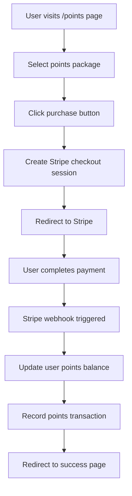
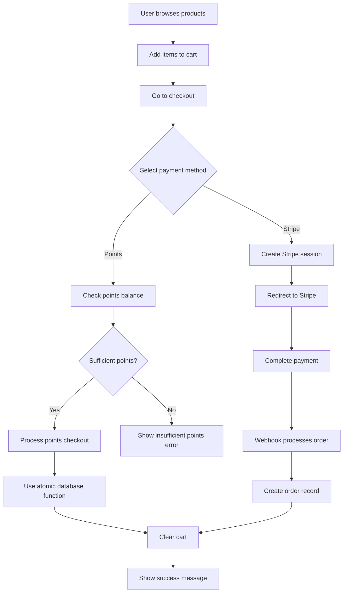

# Purchasing Workflows Documentation

This document outlines the complete workflows for purchasing points and purchasing images in the AI Shop application.

## Overview

The AI Shop supports two main purchasing workflows:

1. **Points Purchase** - Users buy points with real money via Stripe
2. **Image Purchase** - Users buy AI-generated images using either points or Stripe payments

## Database Schema

### Core Tables

| Table                 | Purpose                           | Key Fields                                                           |
| --------------------- | --------------------------------- | -------------------------------------------------------------------- |
| `profiles`            | User profiles with points balance | `id`, `email`, `points`                                              |
| `products`            | AI-generated image products       | `id`, `name`, `price_cents`, `points_price`                          |
| `cart_items`          | Shopping cart items               | `user_id`, `product_id`, `quantity`                                  |
| `orders`              | Purchase orders                   | `user_id`, `total_cents`, `total_points`, `payment_method`, `status` |
| `order_items`         | Individual items in orders        | `order_id`, `product_id`, `quantity`, `price_cents`, `points_price`  |
| `points_transactions` | Points purchase/spend history     | `user_id`, `amount`, `type`, `description`                           |
| `webhook_events`      | Webhook idempotency tracking      | `stripe_event_id`, `event_type`, `status`                            |

## Workflow 1: Points Purchase

### Process Flow

### Points Packages

| Package | Points | Bonus | Price  | Value        |
| ------- | ------ | ----- | ------ | ------------ |
| Basic   | 100    | 0     | $9.99  | $0.10/point  |
| Premium | 500    | 50    | $39.99 | $0.073/point |
| Pro     | 1000   | 200   | $69.99 | $0.058/point |

### Technical Implementation

#### 1. Frontend (Points Page)

- **File**: `src/app/points/page.tsx`
- **Key Functions**:
  - `purchasePoints()` - Initiates Stripe checkout
  - Displays current points balance
  - Shows transaction history

#### 2. API Endpoint

- **File**: `src/app/api/checkout/points/route.ts`
- **Process**:
  1. Validates user authentication
  2. Validates package data and pricing
  3. Implements rate limiting (3 attempts per 5 minutes)
  4. Creates Stripe checkout session with metadata
  5. Returns checkout URL

#### 3. Stripe Webhook

- **File**: `src/app/api/webhooks/stripe/route.ts`
- **Process**:
  1. Verifies webhook signature
  2. Checks for duplicate events (idempotency)
  3. Handles `checkout.session.completed` event
  4. Uses atomic database function `process_points_purchase()`
  5. Records transaction in `points_transactions`

### Error Handling

| Error Type                   | Handling                                      |
| ---------------------------- | --------------------------------------------- |
| Authentication failure       | Return 401 Unauthorized                       |
| Rate limit exceeded          | Return 429 Too Many Requests                  |
| Invalid package data         | Return 400 Bad Request with validation errors |
| Stripe API errors            | Return 503 Service Unavailable                |
| Database errors              | Rollback transaction, return 500              |
| Webhook verification failure | Return 400 Bad Request                        |

## Workflow 2: Image Purchase

### Process Flow

### Payment Methods

#### Points Payment

- **Immediate processing** - No external payment gateway
- **Validation**: Check user's points balance with atomic operations
- **Process**: Use `process_points_checkout()` database function
- **Transaction record**: Negative amount in `points_transactions`

#### Stripe Payment

- **Deferred processing** - Handled via webhook
- **Process**: Create checkout session, redirect to Stripe
- **Completion**: Webhook uses `process_product_purchase()` function
- **Metadata**: Cart items stored in session metadata

### Technical Implementation

#### 1. Cart Management

- **File**: `src/app/cart/page.tsx`
- **Features**:
  - Add/remove items
  - Update quantities
  - Calculate totals (both $ and points)

#### 2. Checkout Page

- **File**: `src/app/checkout/page.tsx`
- **Features**:
  - Payment method selection
  - Points balance validation
  - Order summary display

#### 3. Checkout API

- **File**: `src/app/api/checkout/route.ts`
- **Enhanced Features**:
  - Rate limiting (5 attempts per minute)
  - Comprehensive input validation
  - Atomic database operations
  - Enhanced error handling

#### 4. Order Completion

- **Success Page**: `src/app/checkout/success/page.tsx`
- **Webhook Processing**: Uses atomic database functions

## Recent Enhancements (2025-06-17)

### Code Improvements Implemented

1. **Enhanced Webhook Processing**

   - Added idempotency checks to prevent duplicate processing
   - Implemented structured logging with timestamps
   - Added database transaction functions for atomic operations
   - Enhanced error handling with specific error codes
   - Added payment failure handling

2. **Improved Checkout Validation**

   - Comprehensive input validation for cart items
   - Rate limiting to prevent abuse
   - Enhanced Stripe session creation with better metadata
   - Atomic database operations using stored procedures

3. **Points System Enhancements**

   - Race condition protection for points updates
   - Atomic points transactions with proper locking
   - Enhanced points package validation
   - Rate limiting for points purchases

4. **Database Functions Added**

   - `update_user_points_atomic()` - Atomic points updates
   - `process_points_purchase()` - Complete points purchase workflow
   - `process_product_purchase()` - Complete product purchase workflow
   - `process_points_checkout()` - Immediate points checkout processing

5. **Error Handling System**
   - Centralized error handling with standardized error codes
   - Structured logging with sanitization of sensitive data
   - Retry mechanisms for database operations
   - Rate limiting utilities

### Security Improvements

1. **Input Validation**

   - Comprehensive validation for all API inputs
   - Sanitization of sensitive data in logs
   - Protection against malformed requests

2. **Rate Limiting**

   - Checkout operations: 5 attempts per minute
   - Points purchases: 3 attempts per 5 minutes
   - User-specific rate limiting

3. **Transaction Safety**
   - Database row locking to prevent race conditions
   - Atomic operations for critical workflows
   - Proper error rollback mechanisms

### Performance Optimizations

1. **Database Indexes**

   - Added indexes on frequently queried columns
   - Optimized webhook event lookups
   - Improved cart and order queries

2. **Caching Strategy**

   - Points balance caching with validation
   - Reduced database calls for profile operations

3. **Error Recovery**
   - Automatic retry mechanisms for transient failures
   - Exponential backoff for database operations

## Troubleshooting Guide

### Common Issues

| Issue               | Symptoms                         | Solution                                                     |
| ------------------- | -------------------------------- | ------------------------------------------------------------ |
| Webhook failures    | Orders not completing            | Check webhook endpoint, verify signature                     |
| Points not updating | Balance doesn't reflect purchase | Check `points_transactions` table, verify webhook processing |
| Cart not clearing   | Items remain after purchase      | Verify order completion logic                                |
| Rate limit errors   | Too many requests error          | Check rate limiting configuration                            |
| Database deadlocks  | Transaction timeout errors       | Review atomic function implementations                       |

### Debugging Steps

1. **Check webhook logs** in Stripe dashboard
2. **Verify database transactions** in Supabase
3. **Monitor API response times** and error rates
4. **Review user session data** for authentication issues
5. **Check rate limiting status** for affected users

## Future Enhancements

1. **Advanced Analytics**

   - Real-time purchase analytics dashboard
   - User behavior tracking and insights
   - Revenue forecasting and reporting

2. **Mobile Optimization**

   - Progressive Web App features
   - Push notifications for order updates
   - Offline cart functionality

3. **Payment Method Expansion**
   - PayPal integration
   - Cryptocurrency payments
   - Buy now, pay later options
