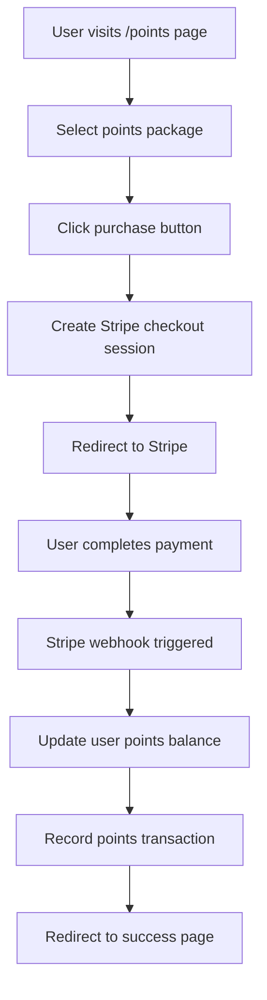
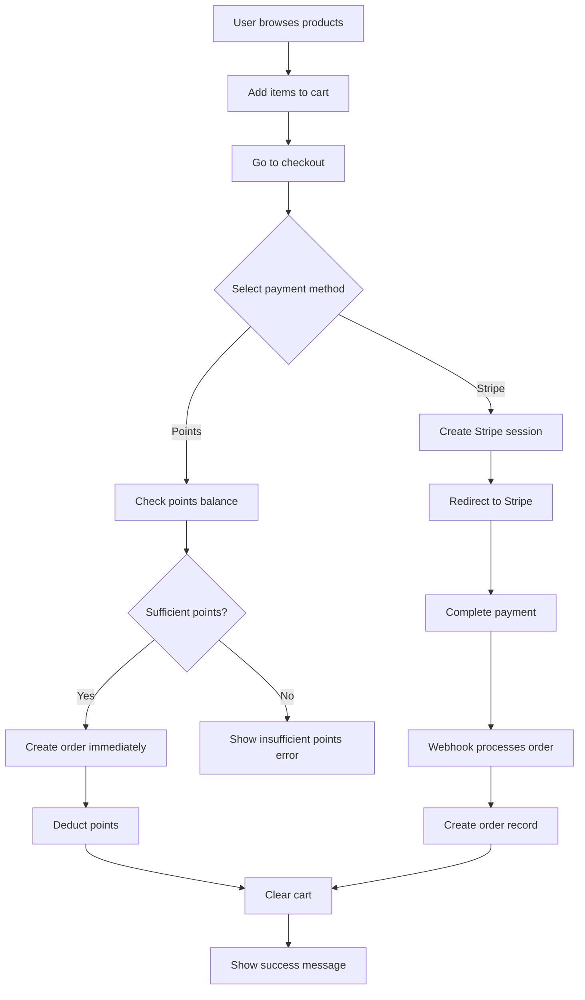

# Purchasing Workflows Documentation

This `Augment` generated document outlines the complete workflows for purchasing points and purchasing images in the AI Shop application.

## Overview

The AI Shop supports two main purchasing workflows:
1. **Points Purchase** - Users buy points with real money via Stripe
2. **Image Purchase** - Users buy AI-generated images using either points or Stripe payments

## Database Schema

### Core Tables

| Table | Purpose | Key Fields |
|-------|---------|------------|
| `profiles` | User profiles with points balance | `id`, `email`, `points` |
| `products` | AI-generated image products | `id`, `name`, `price_cents`, `points_price` |
| `cart_items` | Shopping cart items | `user_id`, `product_id`, `quantity` |
| `orders` | Purchase orders | `user_id`, `total_cents`, `total_points`, `payment_method`, `status` |
| `order_items` | Individual items in orders | `order_id`, `product_id`, `quantity`, `price_cents`, `points_price` |
| `points_transactions` | Points purchase/spend history | `user_id`, `amount`, `type`, `description` |

## Workflow 1: Points Purchase

### Process Flow



### Points Packages

| Package | Points | Bonus | Price | Value |
|---------|--------|-------|-------|-------|
| Basic | 100 | 0 | $9.99 | $0.10/point |
| Premium | 500 | 50 | $39.99 | $0.073/point |
| Pro | 1000 | 200 | $69.99 | $0.058/point |

### Technical Implementation

#### 1. Frontend (Points Page)
- **File**: `src/app/points/page.tsx`
- **Key Functions**:
  - `purchasePoints()` - Initiates Stripe checkout
  - Displays current points balance
  - Shows transaction history

#### 2. API Endpoint
- **File**: `src/app/api/checkout/points/route.ts`
- **Process**:
  1. Validates user authentication
  2. Creates Stripe checkout session with metadata
  3. Returns checkout URL

#### 3. Stripe Webhook
- **File**: `src/app/api/webhooks/stripe/route.ts`
- **Process**:
  1. Verifies webhook signature
  2. Handles `checkout.session.completed` event
  3. Updates user points balance
  4. Records transaction in `points_transactions`

### Error Handling

| Error Type | Handling |
|------------|----------|
| Authentication failure | Return 401 Unauthorized |
| Stripe API errors | Log error, return 500 |
| Database errors | Rollback transaction, return 500 |
| Webhook verification failure | Return 400 Bad Request |

## Workflow 2: Image Purchase

### Process Flow



### Payment Methods

#### Points Payment
- **Immediate processing** - No external payment gateway
- **Validation**: Check user's points balance
- **Process**: Deduct points, create order, clear cart
- **Transaction record**: Negative amount in `points_transactions`

#### Stripe Payment
- **Deferred processing** - Handled via webhook
- **Process**: Create checkout session, redirect to Stripe
- **Completion**: Webhook creates order and clears cart
- **Metadata**: Cart items stored in session metadata

### Technical Implementation

#### 1. Cart Management
- **File**: `src/app/cart/page.tsx`
- **Features**:
  - Add/remove items
  - Update quantities
  - Calculate totals (both $ and points)

#### 2. Checkout Page
- **File**: `src/app/checkout/page.tsx`
- **Features**:
  - Payment method selection
  - Points balance validation
  - Order summary display

#### 3. Checkout API
- **File**: `src/app/api/checkout/route.ts`
- **Points Flow**:
  1. Validate points balance
  2. Create order with `status: 'completed'`
  3. Create order items
  4. Deduct points from user
  5. Record points transaction
  6. Clear cart

- **Stripe Flow**:
  1. Create Stripe checkout session
  2. Include cart items in metadata
  3. Return checkout URL

#### 4. Order Completion
- **Success Page**: `src/app/checkout/success/page.tsx`
- **Webhook Processing**: Same webhook handles both points and product purchases

## Optimization Suggestions

### Performance Optimizations

1. **Database Indexing**
   ```sql
   -- Add indexes for better query performance
   CREATE INDEX idx_cart_items_user_id ON cart_items(user_id);
   CREATE INDEX idx_orders_user_id ON orders(user_id);
   CREATE INDEX idx_points_transactions_user_id ON points_transactions(user_id);
   CREATE INDEX idx_order_items_order_id ON order_items(order_id);
   ```

2. **Caching Strategy**
   - Cache product data (rarely changes)
   - Cache user points balance with short TTL
   - Use Redis for session storage

3. **Database Connection Pooling**
   - Implement connection pooling for Supabase
   - Use read replicas for product queries

### User Experience Improvements

1. **Real-time Updates**
   - WebSocket connections for cart updates
   - Real-time points balance updates
   - Live order status updates

2. **Progressive Web App Features**
   - Offline cart functionality
   - Push notifications for order updates
   - Background sync for failed transactions

3. **Enhanced Checkout**
   - One-click purchase for returning customers
   - Saved payment methods
   - Guest checkout option

### Security Enhancements

1. **Rate Limiting**
   ```javascript
   // Implement rate limiting for purchase endpoints
   const rateLimit = {
     '/api/checkout': '10 requests per minute',
     '/api/checkout/points': '5 requests per minute'
   }
   ```

2. **Fraud Prevention**
   - Implement purchase velocity checks
   - Monitor for suspicious patterns
   - Add CAPTCHA for high-value purchases

3. **Data Validation**
   - Server-side validation for all inputs
   - Sanitize user data
   - Implement CSRF protection

### Monitoring and Analytics

1. **Key Metrics to Track**
   - Conversion rates by payment method
   - Average order value
   - Points redemption rates
   - Cart abandonment rates
   - Payment failure rates

2. **Error Monitoring**
   - Webhook failure alerts
   - Payment processing errors
   - Database transaction failures

3. **Business Intelligence**
   - Revenue analytics dashboard
   - User behavior tracking
   - Product performance metrics

## Troubleshooting Guide

### Common Issues

| Issue | Symptoms | Solution |
|-------|----------|----------|
| Webhook failures | Orders not completing | Check webhook endpoint, verify signature |
| Points not updating | Balance doesn't reflect purchase | Check `points_transactions` table, verify webhook processing |
| Cart not clearing | Items remain after purchase | Verify order completion logic |
| Insufficient points error | False positive on balance check | Check for race conditions, implement proper locking |

### Debugging Steps

1. **Check webhook logs** in Stripe dashboard
2. **Verify database transactions** in Supabase
3. **Monitor API response times** and error rates
4. **Review user session data** for authentication issues

## Future Enhancements

1. **Subscription Model**
   - Monthly/yearly plans with point allowances
   - Tiered pricing with different benefits

2. **Loyalty Program**
   - Bonus points for frequent purchases
   - Referral rewards system

3. **Bulk Purchase Discounts**
   - Volume pricing for large orders
   - Corporate accounts with special rates

4. **Payment Method Expansion**
   - PayPal integration
   - Cryptocurrency payments
   - Buy now, pay later options
