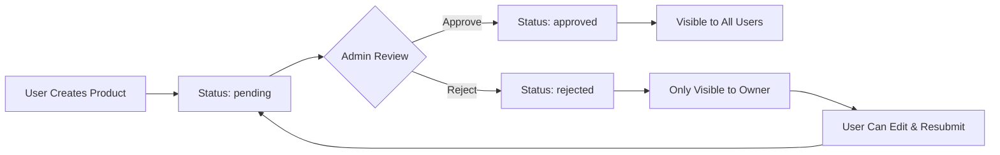

# Product Status Workflow

## Overview

The Adult Products Gallery implements a comprehensive content moderation system to ensure all products meet quality and compliance standards before being visible to users.

## Status Flow



## Product Statuses

### 🟡 Pending (Default)

- **Meaning**: Product submitted but awaiting moderation review
- **Visibility**: Only visible to the product owner and administrators
- **User Actions**: Can edit or delete their own pending products
- **Admin Actions**: Can approve or reject the product

### 🟢 Approved

- **Meaning**: Product passed moderation and is live in the marketplace
- **Visibility**: Visible to all users in product listings and search
- **User Actions**: Can purchase, add to cart, leave reviews
- **Admin Actions**: Can still reject if issues are found later

### 🔴 Rejected

- **Meaning**: Product didn't meet content guidelines or quality standards
- **Visibility**: Only visible to the product owner
- **User Actions**: Can view rejection reason, edit product, and resubmit
- **Admin Actions**: Can provide detailed feedback in moderation notes

## Moderation Methods

### Method 1: Admin Interface (Recommended)

#### Access

- **URL**: `/admin/moderation`
- **Requirements**: Admin user account
- **Features**: Visual interface with product previews

#### Features

- Filter products by status (pending, approved, rejected, all)
- View product details including images, descriptions, and metadata
- Add moderation notes for rejected products
- Bulk actions for efficient review
- Content warning and compliance checks

#### Usage

1. Navigate to the admin moderation panel
2. Review product details and content
3. Click **Approve** or **Reject** buttons
4. Add notes for rejected products explaining the reason

### Method 2: Command Line Script

#### Available Commands

```bash
# List all pending products
node scripts/approve-product.js list

# Approve all pending products (development use)
node scripts/approve-product.js all

# Approve specific product by ID
node scripts/approve-product.js <product-id>
```

#### Script Features

- Lists pending products with creation dates
- Bulk approval for development/testing
- Individual product approval
- Automatic timestamp recording

### Method 3: API Endpoints

#### Check Product Status

```bash
GET /api/products/status?id=<product-id>
GET /api/products/status?status=pending
```

#### Update Product Status

```bash
POST /api/products/status
{
  "productId": "uuid",
  "status": "approved|rejected|pending",
  "notes": "Optional moderation notes"
}
```

### Method 4: Direct Database Access

#### SQL Queries

```sql
-- Approve specific product
UPDATE products
SET moderation_status = 'approved',
    moderated_at = NOW()
WHERE id = 'product-uuid';

-- Check product statuses
SELECT id, name, moderation_status, created_at
FROM products
ORDER BY created_at DESC;
```

## Moderation Guidelines

### Approval Criteria

- ✅ Product meets adult content guidelines
- ✅ Images/videos are clear and appropriate quality
- ✅ Product description is accurate and detailed
- ✅ Pricing is reasonable and properly set
- ✅ Content warnings are appropriately applied
- ✅ Age restrictions are correctly configured

### Rejection Reasons

- ❌ Poor image/video quality
- ❌ Inappropriate or misleading content
- ❌ Incomplete product information
- ❌ Pricing issues or errors
- ❌ Missing required content warnings
- ❌ Violation of platform guidelines

## Database Schema

### Products Table Fields

```sql
moderation_status: TEXT DEFAULT 'approved'
  CHECK (moderation_status IN ('pending', 'approved', 'rejected'))
moderated_at: TIMESTAMP WITH TIME ZONE
moderator_notes: TEXT
```

**Note**: For demo purposes, products default to 'approved' status and are immediately visible to users.

## Known Issues & Fixes

### Upload Error: "document is not defined"

**Issue**: When uploading images, you might see "Failed to upload [filename]: document is not defined" but the upload still succeeds.

**Cause**: Server-side rendering (SSR) trying to access browser-only APIs during the initial render.

**Status**: ✅ **Fixed** - Added proper browser environment checks to prevent SSR errors.

**Files Updated**:

- `src/components/MediaUploadSection.tsx` - Added browser checks for video thumbnail generation
- `src/lib/media-compression.ts` - Added browser checks for image compression
- `src/lib/media-upload-utils.ts` - Added browser checks for canvas operations
- `src/lib/seo-utils.ts` - Added browser checks for DOM manipulation

The upload functionality now works correctly without SSR errors.

### Status Tracking

- **created_at**: When product was initially created
- **moderated_at**: When status was last changed by moderator
- **moderator_notes**: Feedback for rejected products or approval notes

## Workflow Recommendations

### For Development

- Use command line script for quick approval: `node scripts/approve-product.js all`
- Set up test products with various statuses for UI testing
- Use API endpoints for automated testing

### For Production

- Use admin interface for proper content review
- Implement approval workflows with multiple moderators
- Set up notifications for pending product reviews
- Track moderation metrics and response times

### For Users

- Clear status indicators in product management interface
- Email notifications for status changes
- Detailed rejection feedback with improvement suggestions
- Easy resubmission process for rejected products

## Security Considerations

### Access Control

- Admin interface requires authenticated admin users
- API endpoints validate user permissions
- Product owners can only see their own rejected products
- Moderation logs track all status changes

### Data Protection

- Moderation notes are only visible to admins and product owners
- Rejected products are hidden from public listings
- User data is protected during the review process

## Monitoring and Analytics

### Key Metrics

- Average time from submission to approval
- Approval vs rejection rates
- Most common rejection reasons
- Moderator workload distribution

### Reporting

- Daily/weekly moderation reports
- Product quality trends
- User satisfaction with moderation process
- Platform compliance metrics

## Troubleshooting

### Common Issues

- **Products stuck in pending**: Check admin queue, verify moderator availability
- **Approved products not visible**: Clear cache, check database status
- **Rejection notifications not sent**: Verify email system, check notification settings

### Debug Commands

```bash
# Check specific product status
node scripts/approve-product.js list | grep "product-name"

# Verify database connection
curl "/api/products/status?status=pending"
```

## Integration Points

### Email Notifications

- Product approval confirmations
- Rejection notifications with feedback
- Reminder emails for pending reviews

### User Interface

- Status badges in product listings
- Moderation queue for admins
- User dashboard with product status

### Analytics

- Moderation performance tracking
- Content quality metrics
- User engagement with approved products
